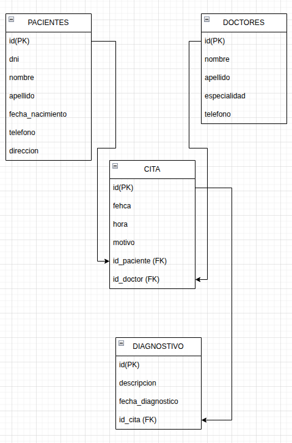
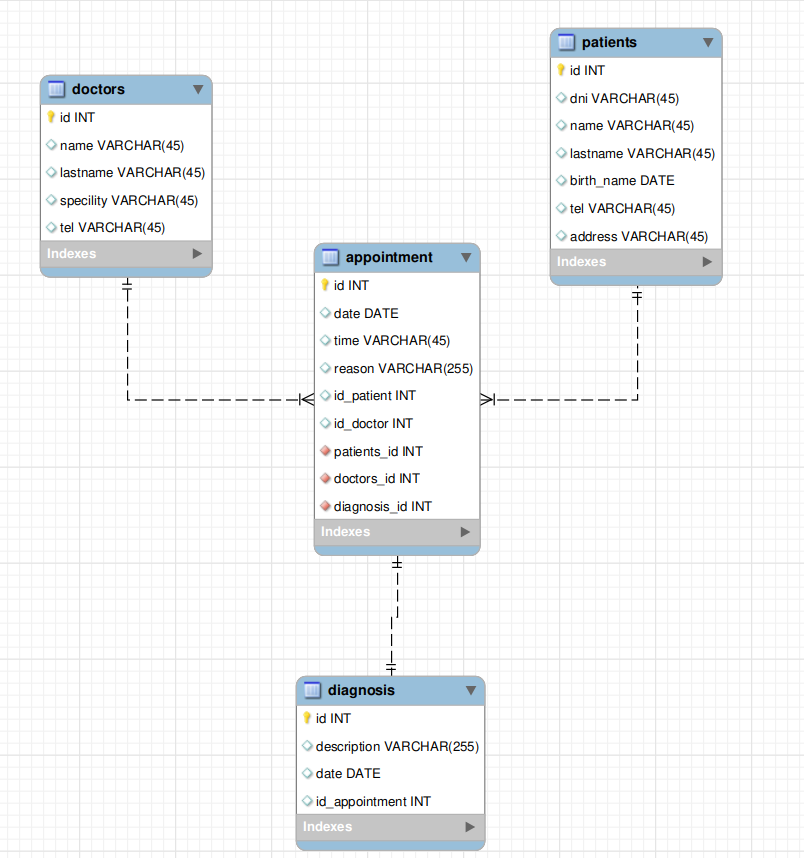

## Diseño de Base de Datos – Hospital “Vida Sana”

### Objetivo

Diseñar una base de datos relacional normalizada hasta 3FN para gestionar:

- Pacientes
- Médicos
- Citas
- Diagnósticos

Garantizando consistencia, integridad y ausencia de duplicidades, mediante:

1. Modelo Conceptual (DER)
2. Modelo Relacional equivalente

### TASK 1 – Análisis y planificación
Requisitos del sistema
El hospital necesita:

- Registrar pacientes y médicos
- Gestionar citas entre pacientes y médicos
- Registrar diagnósticos derivados de una cita

**Entidades principales identificadas**
```
Entidad	        |           Descripción
Paciente	            Persona que recibe atención médica
Médico	            Profesional que atiende pacientes
Cita	            Encuentro entre paciente y médico
Diagnóstico	   Resultado médico asociado a una cita
```

#### Reglas de negocio clave

- Un paciente puede tener muchas citas
- Un médico puede atender muchas citas
- Cada cita corresponde a un solo paciente y un solo médico
- Una cita puede tener uno o varios diagnósticos
- Un diagnóstico no existe sin una cita

#### Desde el inicio se evita:

- Atributos multivaluados
- Dependencias parciales o transitivas
→ Normalización implícita hasta Tercera Forma Normal (3FN)

### TASK 2 – Modelo Conceptual (DER)
Entidades y atributos
```
    PACIENTE
------------------
id_paciente (PK)
dni
nombre
apellido
fecha_nacimiento
telefono
direccion
```
```
     MÉDICO
------------------
id_medico (PK)
nombre
apellido
especialidad
telefono
```
```
      CITA
------------------
id_cita (PK)
fecha
hora
motivo
id_paciente (FK)
id_medico (FK)
```
```
   DIAGNÓSTICO
------------------
id_diagnostico (PK)
descripcion
fecha_diagnostico
id_cita (FK)
```


#### Relaciones (cardinalidades)

- Paciente (1) — (N) Cita
- Médico (1) — (N) Cita
- Cita (1) — (1) Diagnóstico

---

#### TASK 3 – Modelo Relacional
Tablas resultantes (correspondencia 1:1 con el DER)
```
Tabla: PACIENTE
Campo	Tipo de dato
id_paciente (PK)	INT
dni	VARCHAR(15)
nombre	VARCHAR(50)
apellido	VARCHAR(50)
fecha_nacimiento	DATE
telefono	VARCHAR(20)
direccion	VARCHAR(100)
```
```
Tabla: MEDICO
Campo	Tipo de dato
id_medico (PK)	INT
nombre	VARCHAR(50)
apellido	VARCHAR(50)
especialidad	VARCHAR(50)
telefono	VARCHAR(20)
```
```
Tabla: CITA
Campo	Tipo de dato
id_cita (PK)	INT
fecha	DATE
hora	TIME
motivo	VARCHAR(100)
id_paciente (FK)	INT
id_medico (FK)	INT
```
```
Tabla: DIAGNOSTICO
Campo	Tipo de dato
id_diagnostico (PK)	INT
descripcion	VARCHAR(255)
fecha_diagnostico	DATE
id_cita (FK)	INT
```


#### TASK 4 – Revisión de integridad y normalización
**Verificación de 3FN**

- 1FN:No hay atributos multivaluados; Todos los campos son atómicos
- 2FN: No existen claves compuestas; Todos los atributos dependen de la PK completa
- 3FN: No hay dependencias transitivas; Datos de médicos y pacientes no se repiten en citas

Integridad referencial: Todas las FK apuntan a PK válidas; Diagnóstico depende obligatoriamente de Cita