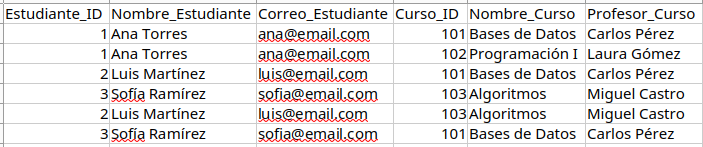
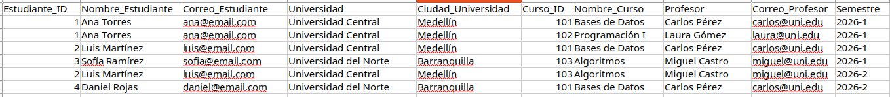
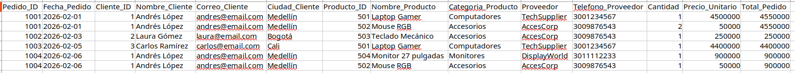
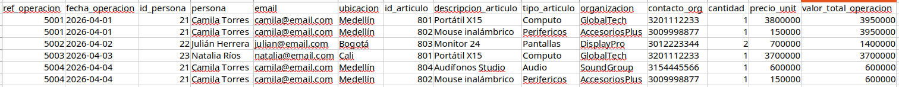

# Ejercicios JOIN


## Ejercicios 1


```sql
    create table profesores (
        
        id int PRIMARY KEY auto_increment,
        name varchar(55),
        lastname varchar(55)
    )

    create table estudiante (
        id int PRIMARY KEY auto_increment,
        name varchar(55),
        lastname varchar(55),
        email varchar(100) UNIQUE 
    )

    create TABLE cursos (
        id int PRIMARY KEY auto_increment,
        name varchar(55),
        profesor_id int,
        foreign KEY (profesor_id) REFERENCES profesores(id)
    )

    create table estudiante_has_curso (
        id int PRIMARY KEY auto_increment,
        estudiante_id int,
        curso_id int,
        foreign KEY (estudiante_id) REFERENCES estudiante(id),
        foreign KEY (curso_id) REFERENCES cursos(id)
    )


    ---- eliminar constrain primero
    ALTER TABLE cursos DROP FOREIGN KEY cursos_ibfk_1;
    --- luego eliminar columna
    alter table cursos drop column estudiante_id


    ---------------- insert ------------------------------------
    insert into profesores (name,lastname) values
    ('Carlos', 'Pérez'),
    ('Laura', 'Gómez'),
    ('Miguel', 'Castro');

    insert into estudiante (name,lastname, email) values
    ('Ana', 'Torres','ana@email.com'),
    ('Luis', 'Martínez','luis@email.com'),
    ('Sofía', 'Ramírez','sofia@email.com');


    insert into cursos (name, profesor_id) values
    ('Bases de Datos', 1),
    ('Programación I', 2),
    ('Algoritmos', 3);


    insert into estudiante_has_curso (estudiante_id, curso_id) values
    (1,1),
    (1,2),
    (2,1),
    (3,3),
    (2,3),
    (3,1);

    -------------------- show data
    SELECT  * FROM estudiante e 

    SELECT * FROM profesores p 

    SELECT * FROM cursos c 

    SELECT * FROM estudiante_has_curso ehc

    ----------------------- join
    SELECT e.name, e.lastname, e.email,ehc.id, c.name, p.name, p.lastname 
    FROM estudiante_has_curso ehc
    inner join cursos c 
    on ehc.curso_id = c.id
    inner join estudiante e
    on ehc.estudiante_id = e.id
    INNER join profesores p
    on c.profesor_id = p.id 
```

## Ejercicios 2


```sql
-- Tabla Profesores
CREATE TABLE profesores (
    id INT PRIMARY KEY AUTO_INCREMENT,
    name VARCHAR(55) NOT NULL,
    lastname VARCHAR(55) NOT NULL
);

-- Tabla Estudiantes
CREATE TABLE estudiante (
    id INT PRIMARY KEY AUTO_INCREMENT,
    name VARCHAR(55) NOT NULL,
    lastname VARCHAR(55) NOT NULL,
    email VARCHAR(100) UNIQUE NOT NULL
);

-- Tabla Cursos
CREATE TABLE cursos (
    id INT PRIMARY KEY AUTO_INCREMENT,
    name VARCHAR(55) NOT NULL,
    profesor_id INT NOT NULL,
    CONSTRAINT fk_curso_profesor
        FOREIGN KEY (profesor_id) 
        REFERENCES profesores(id)
        ON DELETE CASCADE
        ON UPDATE CASCADE
);

-- Tabla Intermedia (Muchos a Muchos)
CREATE TABLE estudiante_has_curso (
    id INT PRIMARY KEY AUTO_INCREMENT,
    estudiante_id INT NOT NULL,
    curso_id INT NOT NULL,
    CONSTRAINT fk_estudiante
        FOREIGN KEY (estudiante_id) 
        REFERENCES estudiante(id)
        ON DELETE CASCADE
        ON UPDATE CASCADE,
    CONSTRAINT fk_curso
        FOREIGN KEY (curso_id) 
        REFERENCES cursos(id)
        ON DELETE CASCADE
        ON UPDATE CASCADE
);


-- Insertar Profesores
INSERT INTO profesores (name, lastname) VALUES
('Carlos', 'Pérez'),
('Laura', 'Gómez'),
('Miguel', 'Castro');

-- Insertar Estudiantes
INSERT INTO estudiante (name, lastname, email) VALUES
('Ana', 'Torres','ana@email.com'),
('Luis', 'Martínez','luis@email.com'),
('Sofía', 'Ramírez','sofia@email.com');

-- Insertar Cursos
INSERT INTO cursos (name, profesor_id) VALUES
('Bases de Datos', 1),
('Programación I', 2),
('Algoritmos', 3);

-- Insertar Relación Estudiante-Curso
INSERT INTO estudiante_has_curso (estudiante_id, curso_id) VALUES
(1,1),
(1,2),
(2,1),
(3,3),
(2,3),
(3,1);

-- JOIN
SELECT 
    e.id AS Estudiante_ID,
    CONCAT(e.name, ' ', e.lastname) AS Nombre_Estudiante,
    e.email AS Correo_Estudiante,
    c.id AS Curso_ID,
    c.name AS Nombre_Curso,
    CONCAT(p.name, ' ', p.lastname) AS Profesor
FROM estudiante_has_curso ehc
INNER JOIN estudiante e 
    ON ehc.estudiante_id = e.id
INNER JOIN cursos c 
    ON ehc.curso_id = c.id
INNER JOIN profesores p 
    ON c.profesor_id = p.id
ORDER BY e.id;
```


## Ejercicios 3


```sql
-- Tabla Clientes
CREATE TABLE clientes (
    id INT PRIMARY KEY AUTO_INCREMENT,
    nombre VARCHAR(60) NOT NULL,
    correo VARCHAR(100) UNIQUE NOT NULL,
    ciudad VARCHAR(60) NOT NULL
);

-- Tabla Proveedores
CREATE TABLE proveedores (
    id INT PRIMARY KEY AUTO_INCREMENT,
    nombre VARCHAR(60) NOT NULL,
    telefono VARCHAR(20) NOT NULL
);

-- Tabla Categorías
CREATE TABLE categorias (
    id INT PRIMARY KEY AUTO_INCREMENT,
    nombre VARCHAR(60) NOT NULL
);

-- Tabla Productos
CREATE TABLE productos (
    id INT PRIMARY KEY AUTO_INCREMENT,
    nombre VARCHAR(80) NOT NULL,
    categoria_id INT NOT NULL,
    proveedor_id INT NOT NULL,
    precio_unitario DECIMAL(12,2) NOT NULL,
    CONSTRAINT fk_producto_categoria
        FOREIGN KEY (categoria_id)
        REFERENCES categorias(id)
        ON DELETE CASCADE
        ON UPDATE CASCADE,
    CONSTRAINT fk_producto_proveedor
        FOREIGN KEY (proveedor_id)
        REFERENCES proveedores(id)
        ON DELETE CASCADE
        ON UPDATE CASCADE
);

-- Tabla Pedidos
CREATE TABLE pedidos (
    id INT PRIMARY KEY AUTO_INCREMENT,
    fecha DATE NOT NULL,
    cliente_id INT NOT NULL,
    CONSTRAINT fk_pedido_cliente
        FOREIGN KEY (cliente_id)
        REFERENCES clientes(id)
        ON DELETE CASCADE
        ON UPDATE CASCADE
);

-- Tabla Detalle Pedido (Muchos a Muchos)
CREATE TABLE detalle_pedido (
    id INT PRIMARY KEY AUTO_INCREMENT,
    pedido_id INT NOT NULL,
    producto_id INT NOT NULL,
    cantidad INT NOT NULL,
    CONSTRAINT fk_detalle_pedido
        FOREIGN KEY (pedido_id)
        REFERENCES pedidos(id)
        ON DELETE CASCADE
        ON UPDATE CASCADE,
    CONSTRAINT fk_detalle_producto
        FOREIGN KEY (producto_id)
        REFERENCES productos(id)
        ON DELETE CASCADE
        ON UPDATE CASCADE
);

-- Insertar Clientes
INSERT INTO clientes (nombre, correo, ciudad) VALUES
('Andrés López', 'andres@email.com', 'Medellín'),
('Laura Gómez', 'laura@email.com', 'Bogotá'),
('Carlos Ramírez', 'carlos@email.com', 'Cali');

-- Insertar Proveedores
INSERT INTO proveedores (nombre, telefono) VALUES
('TechSupplier', '3001234567'),
('AccesCorp', '3009876543'),
('DisplayWorld', '301112233');

-- Insertar Categorías
INSERT INTO categorias (nombre) VALUES
('Computadores'),
('Accesorios'),
('Monitores');

-- Insertar Productos
INSERT INTO productos (nombre, categoria_id, proveedor_id, precio_unitario) VALUES
('Laptop Gamer', 1, 1, 4500000),
('Mouse RGB', 2, 2, 50000),
('Teclado Mecánico', 2, 2, 250000),
('Monitor 27 pulgadas', 3, 3, 900000);

-- Insertar Pedidos
INSERT INTO pedidos (id, fecha, cliente_id) VALUES
(1001, '2026-02-01', 1),
(1002, '2026-02-03', 2),
(1003, '2026-02-05', 3),
(1004, '2026-02-06', 1);

-- Insertar Detalle Pedido
INSERT INTO detalle_pedido (pedido_id, producto_id, cantidad) VALUES
(1001, 1, 1),
(1001, 2, 2),
(1002, 3, 1),
(1003, 1, 1),
(1004, 4, 1),
(1004, 2, 1);

--JOIN
SELECT 
    p.id AS Pedido_ID,
    p.fecha AS Fecha_Pedido,
    c.id AS Cliente_ID,
    c.nombre AS Nombre_Cliente,
    c.correo AS Correo_Cliente,
    c.ciudad AS Ciudad_Cliente,
    pr.id AS Producto_ID,
    pr.nombre AS Nombre_Producto,
    cat.nombre AS Categoria_Producto,
    prov.nombre AS Proveedor,
    prov.telefono AS Telefono_Proveedor,
    dp.cantidad AS Cantidad,
    pr.precio_unitario AS Precio_Unitario,
    (dp.cantidad * pr.precio_unitario) AS Total_Pedido
FROM detalle_pedido dp
INNER JOIN pedidos p ON dp.pedido_id = p.id
INNER JOIN clientes c ON p.cliente_id = c.id
INNER JOIN productos pr ON dp.producto_id = pr.id
INNER JOIN categorias cat ON pr.categoria_id = cat.id
INNER JOIN proveedores prov ON pr.proveedor_id = prov.id
ORDER BY p.id;
```

## Ejercicios 4


```sql
-- Tabla Personas
CREATE TABLE personas (
    id INT PRIMARY KEY AUTO_INCREMENT,
    nombre VARCHAR(80) NOT NULL,
    email VARCHAR(100) UNIQUE NOT NULL,
    ubicacion VARCHAR(60) NOT NULL
);

-- Tabla Organizaciones
CREATE TABLE organizaciones (
    id INT PRIMARY KEY AUTO_INCREMENT,
    nombre VARCHAR(80) NOT NULL,
    contacto VARCHAR(20) NOT NULL
);

-- Tabla Tipos de Artículo
CREATE TABLE tipos_articulo (
    id INT PRIMARY KEY AUTO_INCREMENT,
    nombre VARCHAR(60) NOT NULL
);

-- Tabla Artículos
CREATE TABLE articulos (
    id INT PRIMARY KEY AUTO_INCREMENT,
    descripcion VARCHAR(100) NOT NULL,
    tipo_id INT NOT NULL,
    organizacion_id INT NOT NULL,
    precio_unitario DECIMAL(12,2) NOT NULL,
    CONSTRAINT fk_articulo_tipo
        FOREIGN KEY (tipo_id)
        REFERENCES tipos_articulo(id)
        ON DELETE CASCADE
        ON UPDATE CASCADE,
    CONSTRAINT fk_articulo_organizacion
        FOREIGN KEY (organizacion_id)
        REFERENCES organizaciones(id)
        ON DELETE CASCADE
        ON UPDATE CASCADE
);

-- Tabla Operaciones
CREATE TABLE operaciones (
    id INT PRIMARY KEY AUTO_INCREMENT,
    fecha DATE NOT NULL,
    persona_id INT NOT NULL,
    CONSTRAINT fk_operacion_persona
        FOREIGN KEY (persona_id)
        REFERENCES personas(id)
        ON DELETE CASCADE
        ON UPDATE CASCADE
);

-- Tabla Detalle Operación
CREATE TABLE detalle_operacion (
    id INT PRIMARY KEY AUTO_INCREMENT,
    operacion_id INT NOT NULL,
    articulo_id INT NOT NULL,
    cantidad INT NOT NULL,
    CONSTRAINT fk_detalle_operacion
        FOREIGN KEY (operacion_id)
        REFERENCES operaciones(id)
        ON DELETE CASCADE
        ON UPDATE CASCADE,
    CONSTRAINT fk_detalle_articulo
        FOREIGN KEY (articulo_id)
        REFERENCES articulos(id)
        ON DELETE CASCADE
        ON UPDATE CASCADE
);

-- Insertar Personas
INSERT INTO personas (id, nombre, email, ubicacion) VALUES
(21, 'Camila Torres', 'camila@email.com', 'Medellín'),
(22, 'Julián Herrera', 'julian@email.com', 'Bogotá'),
(23, 'Natalia Ríos', 'natalia@email.com', 'Cali');

-- Insertar Organizaciones
INSERT INTO organizaciones (nombre, contacto) VALUES
('GlobalTech', '3201112233'),
('AccesoriosPlus', '3009998877'),
('DisplayPro', '3012223344'),
('SoundGroup', '3154445566');

-- Insertar Tipos de Artículo
INSERT INTO tipos_articulo (nombre) VALUES
('Computo'),
('Periféricos'),
('Pantallas'),
('Audio');

-- Insertar Artículos
INSERT INTO articulos (id, descripcion, tipo_id, organizacion_id, precio_unitario) VALUES
(801, 'Portátil X15', 1, 1, 3800000),
(802, 'Mouse inalámbrico', 2, 2, 150000),
(803, 'Monitor 24', 3, 3, 700000),
(804, 'Audífonos Studio', 4, 4, 600000);

-- Insertar Operaciones
INSERT INTO operaciones (id, fecha, persona_id) VALUES
(5001, '2026-04-01', 21),
(5002, '2026-04-02', 22),
(5003, '2026-04-03', 23),
(5004, '2026-04-04', 21);

-- Insertar Detalle Operación
INSERT INTO detalle_operacion (operacion_id, articulo_id, cantidad) VALUES
(5001, 801, 1),
(5001, 802, 1),
(5002, 803, 2),
(5003, 801, 1),
(5004, 804, 1),
(5004, 802, 1);

SELECT 
    o.id AS ref_operacion,
    o.fecha AS fecha_operacion,
    per.id AS id_persona,
    per.nombre AS persona,
    per.email,
    per.ubicacion,
    a.id AS id_articulo,
    a.descripcion AS descripcion_articulo,
    t.nombre AS tipo_articulo,
    org.nombre AS organizacion,
    org.contacto AS contacto_org,
    d.cantidad,
    a.precio_unitario AS precio_unit,
    (d.cantidad * a.precio_unitario) AS valor_total_operacion
FROM detalle_operacion d
INNER JOIN operaciones o ON d.operacion_id = o.id
INNER JOIN personas per ON o.persona_id = per.id
INNER JOIN articulos a ON d.articulo_id = a.id
INNER JOIN tipos_articulo t ON a.tipo_id = t.id
INNER JOIN organizaciones org ON a.organizacion_id = org.id
ORDER BY o.id;
```

